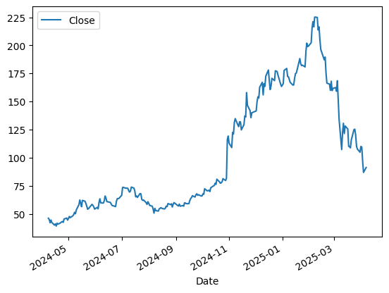
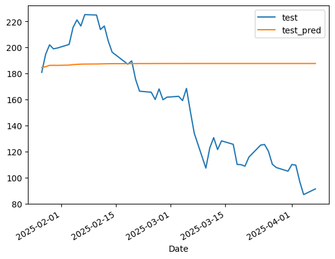
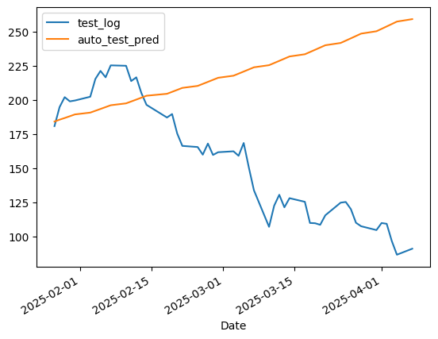
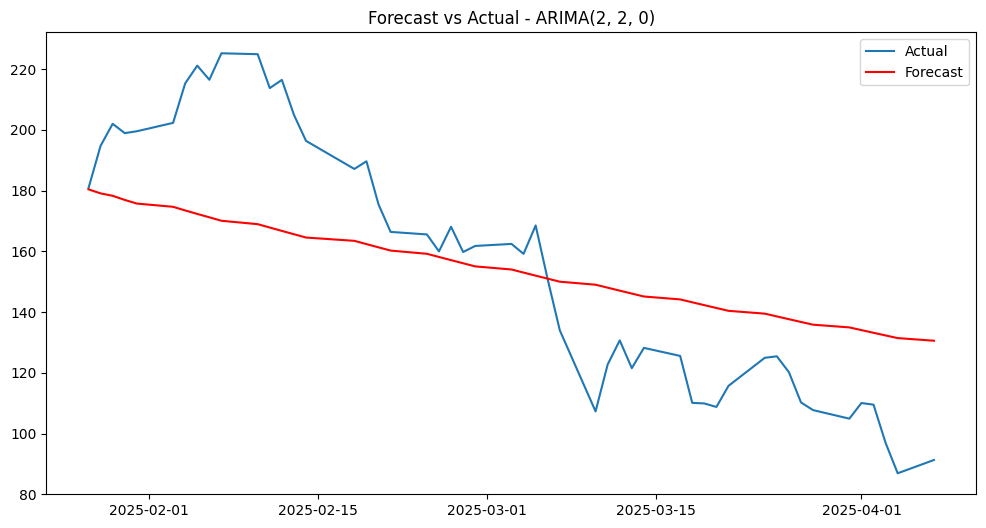

# Stock-Data

RDDT Time Series Analysis

## Table of Contents

1. [Introduction](#introduction)
2. [Data](#data)
3. [Process Outline](#process-outline)
   1. [Initial Observation/Clean](#clean-data)
   2. [Analyze Data](#analyze-data)
   3. [Preprocess Data for Model](#preprocess-data-for-model)
   4. [Model Analysis/Prediction](#model-prediction/analysis)
4. [Next Steps](#next-steps)
5. [References](#references)

## 1 - Introduction 

I made predictions on Reddit (RDDT) stock using time series analysis. I used root mean squared error (RMSE) as the metric for success. RMSE gives the avergae size of prediction errors (i.e higher number means predicitons were further away from actual prices) so I was looking for a model that gave the lowest RMSE.

## 2 - Data 

I used the last year (251 trading days) of Reddit's daily closing stock prices for my analysis. I pulled the data using the YFinance Python library.

## 3 - Process Outline 

My process consisted of making teh data stationary/acceptable for a time series model. I ran into some issues with predictions due to the large price swings, so I also went througbh a few extra steps to determine the most ideal PDQ values for the most accurate prediciton based on RMSE.

### 3i - Initial Observations/Clean 

RDDT went public in March 2024, just a few weeks before my dataset begins. This meant that I was unable to go further back in time for more meaningful data as the remaining information wasn't even an additional month.

Since the data came in from YFinance and consisted of close prices per market day, there were no nulls or duplicates.

### 3ii - Analyze Data 

#### Price Movement

Between April 2024 and February 2025, the stock moved from approximately $50 to $225 per share for an increase of 450%. From February 2025 through the last close on April 4th 2025, the stock moved from approximately $225 to $87 a share for a decrease of 61%.

Both of these moves on their own would be considered large by normal stock market standards. Seeing them together in such a short timeframe is even more unusual. I wondered during my modeling if this would create issues with predictions. I used the last 50 observations as my test set, which means my test set encompasses the 61% drop that started in February. I kept note of this in case it looked ot be creating issues later in the process.

Due to the large price swings, the rolling mean and variances varied throughout the year and needed to be handled in preprocessing.

Upon checking for seasonality, the magnitude of seasonal variation at the weekly, monthly and quarterly levels were insignificant enough that I did not make any edit to the data to accoutn for seasonality.

### 3iii - Preprocess Data for Model 

The data needed to be stationary to run through an ARIMA model. I took the log of the closing prices to smooth out the moving average. I took the difference of the closing prices over their previous close to smooth out the variance moving average.

### 3iv - Model Analysis/Prediction 

#### Initial Predictions - P/D/Q 6-1-1

Based on the analysis of ACF/PACF plots, I chose a 6-1-1- PDQ value for my first predictions. Intiially the ACF/PACF plots showed 0 for P and Q values so I differenced them to get to 6-1-1. The predictions came out flat compared to the actal test prices so I decided to run an auto-ARIMA to determine PDQ values that would give a more accurate prediction.

The RMSE for these predictions was 0.356516

#### Auto-ARIMA Predictions - P/D/Q 2-1-0

Initially auto-ARIMA was returning 0-1-0 as the "best" PDQ values, which is not a model at all. When I reran after the 4/4/25 close, it specified that 2-1-0 was the most ideal.

These predictions actually went the opposite direction of the actual stock price and returned a higher (worse) RMSE of 0.529366.

#### Final Predictions - P/D/Q 2-2-0

Seeing as the price varied widely and there wasn't enough extra data to train on, I decided to run a loop that went through every permutation of PDQ values up to 9-2-9 to try and find a more accurate set of predictions.

The PDQ with the lowest RMSE of all 300 permutations was 2-2-0. The RMSE of these predicitons was 0.191540

## 4 - Next Steps 

I would like to see if there are any other exogenous variables I can include to come up with even more accurate predictions. I would like to see if there are ant other creative ways to account for the large swings in the stock price. Though unusual, it is not unheard of for a stock to move this much and I would like to dig more into the best ways to account for this type of movement.

## References 

Yahoo Finance - https://finance.yahoo.com/

Claude 3.7 Sonnet
